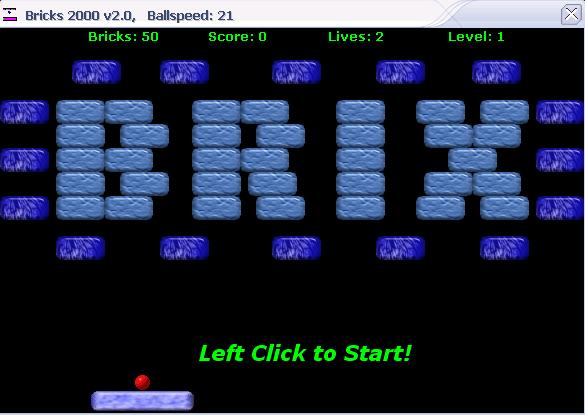



## Bricks 2000 v2\.0

### Description

This is a game similar to DX-Ball or Breakout, where you have to break the bricks by bouncing a ball off your paddle. I have made 5 levels so far, and hope to include sound and powerups eventually. Many snippets of code have come from this site and others, so I am putting this program up for everyones benefit. Please leave any comments or questions!
 
### More Info
 
This is somewhat advanced code, so if your a newbie dont expect to understand it right away.

None known.

             |
---                |---
**Submitted On**   |2002-02-16 10:54:48
**By**             |[Jordan Owen](https://github.com/Planet-Source-Code/PSCIndex/blob/master/ByAuthor/jordan-owen.md)
**Level**          |Advanced
**User Rating**    |5.0 (70 globes from 14 users)
**Compatibility**  |VB 5\.0, VB 6\.0
**Category**       |[Games](https://github.com/Planet-Source-Code/PSCIndex/blob/master/ByCategory/games__1-38.md)
**World**          |[Visual Basic](https://github.com/Planet-Source-Code/PSCIndex/blob/master/ByWorld/visual-basic.md)
**Archive File**   |[Brix\_2000\_555922162002\.zip](https://github.com/Planet-Source-Code/jordan-owen-bricks-2000-v2-0__1-31851/archive/master.zip)

